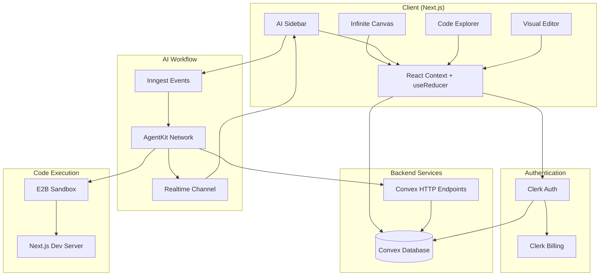
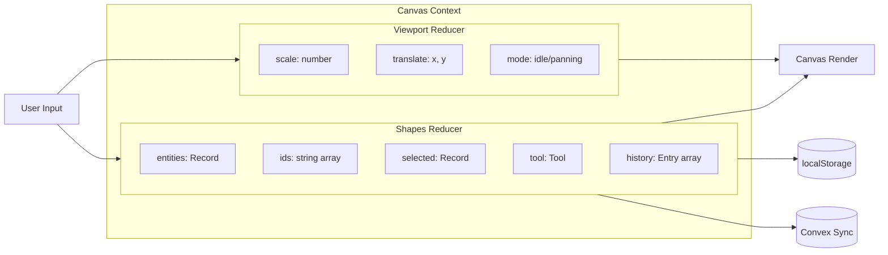
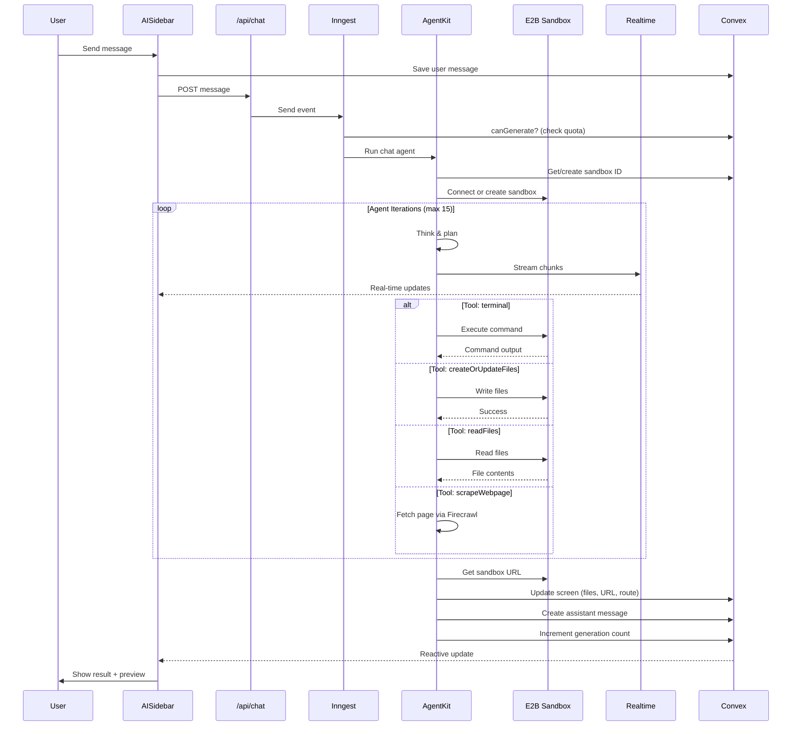
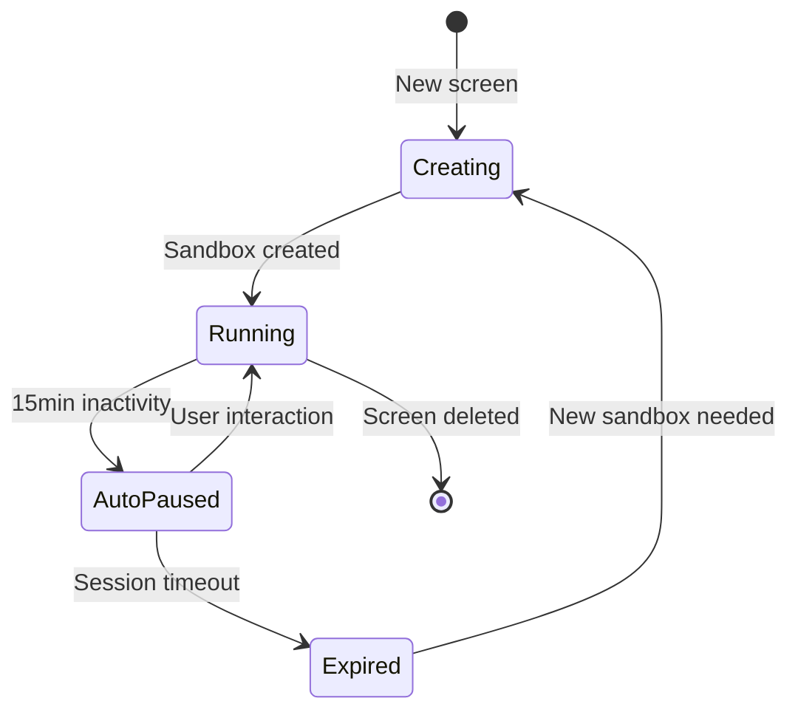
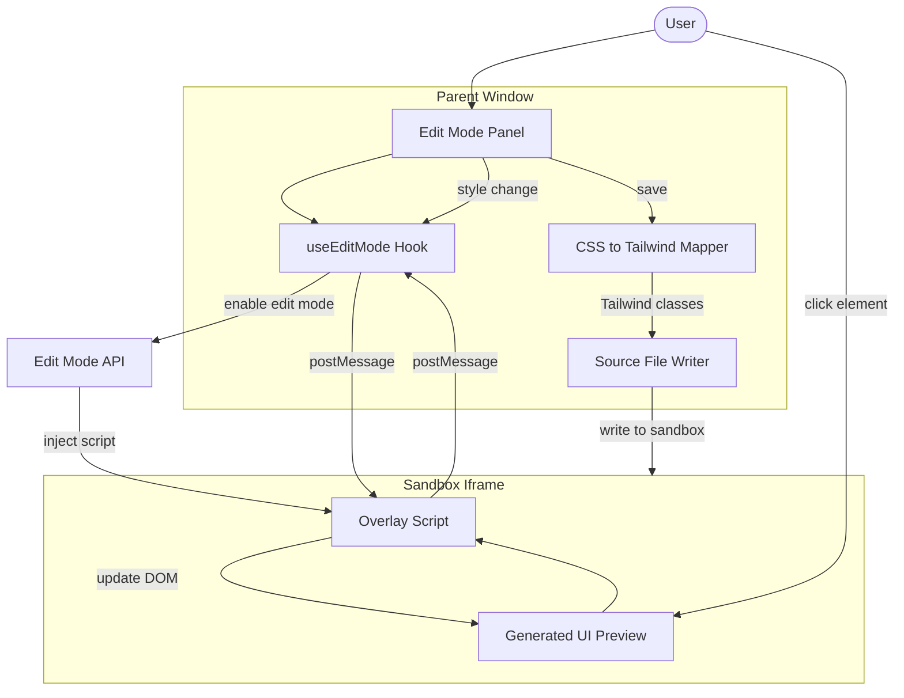
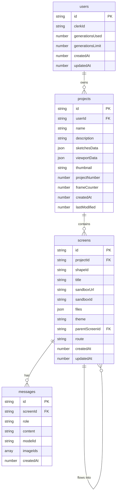
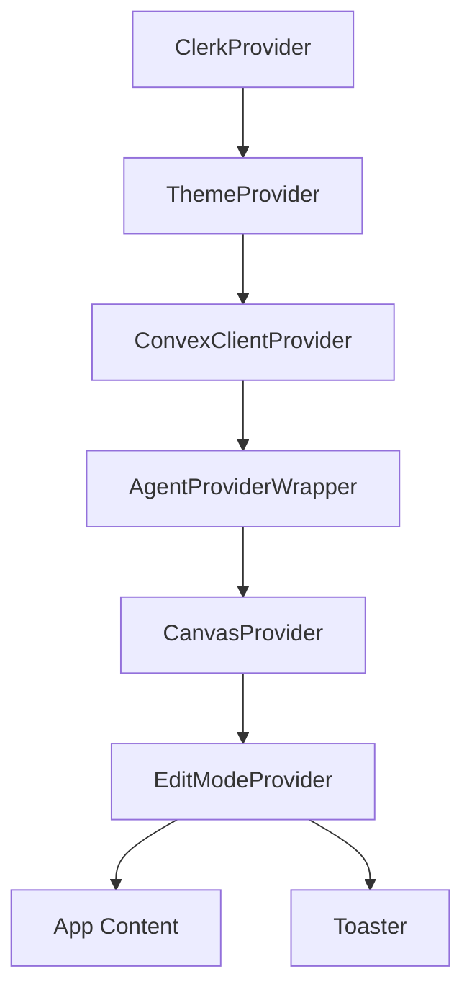
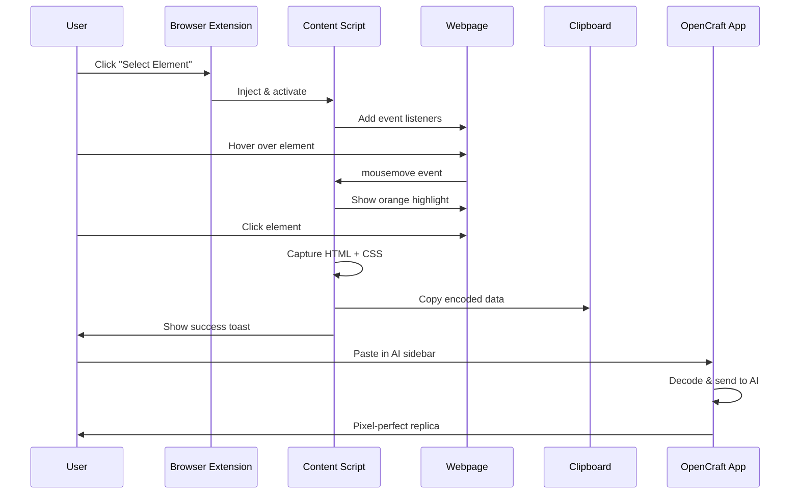
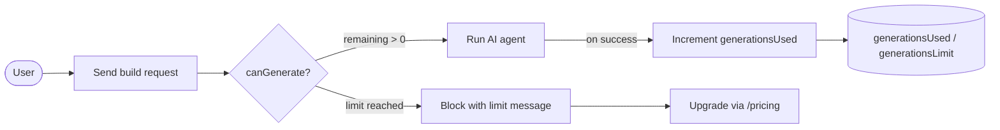

<p align="center">
  
</p>

<p align="center">
  <strong>AI-Powered Design-to-Code Platform</strong>
</p>

<p align="center">
  Transform wireframes into production-ready web applications using the power of AI.
</p>

<p align="center">
  <a href="#features">Features</a> •
  <a href="#tech-stack">Tech Stack</a> •
  <a href="#architecture">Architecture</a> •
  <a href="#browser-extension">Extension</a> •
  <a href="#getting-started">Getting Started</a> •
  <a href="#api-reference">API Reference</a>
</p>

---

## Overview

OpenCraft is a revolutionary design platform that bridges the gap between design and development. Users can sketch wireframes on an infinite canvas, then leverage AI agents to transform those sketches into fully functional, production-ready Next.js applications—all within a single, unified environment.

The platform combines a Figma-like drawing experience with powerful AI code generation, real-time preview, visual editing capabilities, multi-screen flows for prototyping entire products, website cloning from any URL, and a browser extension for capturing elements from any website.

---

## Features

### 🎨 Infinite Canvas

A professional-grade drawing environment with Figma-like interactions:

- **Drawing Tools**: Frames, rectangles, ellipses, lines, arrows, freehand drawing, and text
- **Pan & Zoom**: Middle-click drag, Space+drag, Ctrl/Cmd+wheel zoom around cursor
- **Selection**: Click, Shift+click multi-select, drag selection box
- **Manipulation**: Move, resize with 8-point handles, copy/paste
- **History**: Full undo/redo with Ctrl/Cmd+Z/Y
- **Layers**: Sidebar with shape reordering and visibility
- **Auto-save**: Debounced persistence to localStorage and cloud

### 🤖 AI-Powered Code Generation

Transform designs into functional applications:

- **Multi-Model Support**: Choose from Gemini 3.5 Flash, Kimi K2.7 Code, or MiniMax M3
- **Real-Time Streaming**: Watch the AI think and code in real-time
- **Live Reasoning**: Reasoning tokens stream into a dedicated panel for reasoning-capable models
- **Isolated Sandboxes**: Each generation runs in a secure E2B sandbox
- **Session Persistence**: Sandbox sessions persist for iterative development
- **Vision Support**: Attach images for vision-capable models
- **Conversation History**: Full chat history per screen for context

### 🔀 Flows — Multi-Screen Prototyping

Chain screens together to prototype an entire product, not just isolated pages:

- **Create Flow**: From any generated screen, click **Create Flow** and describe the next page (e.g. "checkout page")
- **Shared Sandbox**: Flow children reuse the parent screen's E2B sandbox and theme, so new pages live inside the _same_ running app and inherit its design system
- **Route-Based Pages**: The agent adds a new route (e.g. `/checkout`) instead of overwriting the home page; each child screen's preview renders its own route
- **Visual Connectors**: Child screens auto-link to their parent with bound elbow arrows that follow shapes as you move and resize them
- **Auto-Prompt**: The flow prompt is queued and sent automatically once the child screen is created

### 🔥 Website Cloning — Firecrawl

Recreate any public webpage with a single prompt:

- **Provide a URL**: Ask the AI to "clone", "recreate", "redesign", or "take inspiration from" a specific page and include its URL
- **Firecrawl Scrape**: The agent's `scrapeWebpage` tool fetches the live page via Firecrawl, extracting cleaned HTML (with class names + inline styles), markdown copy, links, and metadata
- **Faithful Recreation**: The agent rebuilds the page as a React/Next.js component — matching structure, real copy, colors, fonts, and spacing (no lorem ipsum, no substituted theme colors)
- **Guard Rails**: Only triggered when a real URL accompanies a clone/recreate request, so generic build prompts don't waste scraping credits

### ✏️ Visual Edit Mode

Edit generated UI without touching code:

- **Click-to-Select**: Click any element in the preview to select it
- **Style Controls**: Modify colors, spacing, typography, borders
- **CSS-to-Tailwind**: Automatic conversion of style changes to Tailwind classes
- **Source Updates**: Changes are written back to the actual source files

### 📁 Code Explorer

Browse and understand generated code:

- **File Tree**: Navigate the complete project structure
- **Syntax Highlighting**: Shiki-powered code viewing
- **Cached Content**: Instant access to generated files

### 🎭 Theme System

Multiple visual themes for generated applications:

- **Presets**: Default, Claude, Vercel, Cyberpunk, and more
- **Per-Screen Themes**: Each screen can have its own theme
- **Semantic Colors**: Theme-aware color system using CSS variables

### 🔌 Browser Extension

Capture elements from any website for AI replication:

- **Element Selector**: Click any element on any webpage
- **Visual Highlighting**: Orange outline shows selected element
- **Auto-Copy**: Captured HTML, CSS, and metadata copied to clipboard
- **Paste to Replicate**: Paste in OpenCraft AI sidebar for pixel-perfect replication

### 💳 Usage & Billing

Fair usage enforced with a per-user generation limit:

- **Generation Limit**: Each user starts with a default of 10 generations (one is consumed per successful build)
- **Clerk Billing**: Subscription plans are served through Clerk's hosted pricing table at `/pricing`
- **Server-Side Enforcement**: The agent checks remaining quota before each run and increments the count only on success

### 🔐 Authentication

Secure access with Clerk:

- **Social Login**: Google, GitHub, and more
- **Session Management**: Secure JWT-based sessions
- **Convex Integration**: Seamless auth sync with backend

---

## Tech Stack

### Core Framework

| Technology       | Version | Purpose                                   |
| ---------------- | ------- | ----------------------------------------- |
| **Next.js**      | 16.0.7  | App Router, Server Components, API Routes |
| **React**        | 19.2.0  | UI rendering with latest features         |
| **TypeScript**   | 5.x     | Type-safe development                     |
| **Tailwind CSS** | 4.x     | Utility-first styling                     |

### Backend & Database

| Technology  | Purpose                                                |
| ----------- | ------------------------------------------------------ |
| **Convex**  | Real-time database, queries, mutations, HTTP endpoints |
| **Inngest** | Background job orchestration, event-driven workflows   |
| **E2B**     | Isolated sandbox environments for code execution       |

### AI & Streaming

| Technology             | Purpose                           |
| ---------------------- | --------------------------------- |
| **Inngest AgentKit**   | AI agent framework with tools     |
| **@inngest/realtime**  | Real-time event streaming         |
| **@inngest/use-agent** | React hooks for agent interaction |
| **OpenRouter**         | Multi-model AI API gateway        |
| **Firecrawl**          | Webpage scraping for cloning      |

### Authentication & Billing

| Technology        | Purpose                         |
| ----------------- | ------------------------------- |
| **Clerk**         | Authentication, user management |
| **Clerk Billing** | B2C subscription management     |

### UI Components

| Technology        | Purpose                      |
| ----------------- | ---------------------------- |
| **shadcn/ui**     | 60+ accessible UI components |
| **Radix UI**      | Headless UI primitives       |
| **Lucide React**  | Icon library                 |
| **Framer Motion** | Animations and transitions   |

### Utilities

| Library        | Purpose                      |
| -------------- | ---------------------------- |
| **Shiki**      | Syntax highlighting          |
| **Streamdown** | Streaming markdown rendering |
| **nanoid**     | Unique ID generation         |
| **date-fns**   | Date manipulation            |
| **zod**        | Schema validation            |
| **Sonner**     | Toast notifications          |
| **Recharts**   | Data visualization           |

---

## Architecture

### High-Level System Overview



### Canvas State Management



**Key Design Decisions:**

1. **Normalized Entity State**: Shapes stored as `{ ids: string[], entities: Record<string, Shape> }` for O(1) lookups
2. **Separate Reducers**: Viewport and shapes have independent reducers for clean separation
3. **Refs for Interaction State**: Draft shapes, movement, and resize data stored in refs to prevent re-renders
4. **RAF Throttling**: Freehand drawing throttled to 8ms intervals for smooth performance
5. **History Batching**: Move/resize operations batched into single undo entries

**Shape Types:**

```typescript
type Shape =
  | FrameShape // Rectangular frames with auto-numbering
  | RectShape // Basic rectangles
  | EllipseShape // Ellipses/circles
  | FreeDrawShape // Freehand paths
  | ArrowShape // Arrows with endpoints
  | LineShape // Straight lines
  | TextShape // Text with typography controls
  | ScreenShape; // AI-generated UI previews
```

---

### AI Workflow Architecture



**Agent Tools:**

| Tool                  | Description                                                          |
| --------------------- | ------------------------------------------------------------------- |
| `terminal`            | Execute shell commands (npm install, ls, cat)                       |
| `createOrUpdateFiles` | Write files to the sandbox                                          |
| `readFiles`           | Read file contents from sandbox                                     |
| `scrapeWebpage`       | Scrape a live webpage via Firecrawl (HTML, markdown, links) to clone or recreate it |

**Flow Builds:** When a screen has a `parentScreenId`, the agent detects a _flow build_. It connects to the parent's existing sandbox, seeds its context from the parent's files, and is instructed to add a new route (e.g. `app/checkout/page.tsx`) rather than overwrite the home page. The new route is derived from the generated files and persisted to the screen so its preview renders the correct page of the shared app.

**Webpage Recreation:** When the user supplies a URL with a clone/recreate request, the agent calls `scrapeWebpage` first to fetch the page through Firecrawl's `/v2/scrape` endpoint, then recreates it from the returned HTML and markdown before writing any files.

**Sandbox Lifecycle:**



---

### Visual Edit Mode Architecture



**Style Mapping Example:**

```typescript
// Input: CSS style changes
{ fontSize: "18px", backgroundColor: "#3b82f6", padding: "16px" }

// Output: Tailwind classes
["text-lg", "bg-[#3b82f6]", "p-4"]
```

---

### Data Model



---

### Provider Hierarchy



---

## Browser Extension

The OpenCraft Browser Extension allows you to capture any HTML element from any website and replicate it using AI.

### Features

- **Visual Element Selection**: Hover over elements to highlight them with an orange outline
- **One-Click Capture**: Click to capture the element's HTML, computed CSS styles, and metadata
- **Auto-Copy to Clipboard**: Captured data is automatically encoded and copied
- **Size Validation**: Elements over 100KB show a warning to select smaller components
- **Keyboard Support**: Press Escape to cancel selection mode

### How It Works



### Captured Data Structure

```typescript
interface CapturedElement {
  version: string; // "1.0"
  type: string; // "element_capture"
  timestamp: number;
  data: {
    html: string; // outerHTML of element
    styles: {
      // Computed CSS for element + descendants
      [selector: string]: Record<string, string>;
    };
    metadata: {
      tagName: string;
      dimensions: { width: number; height: number };
      position: { top: number; left: number };
      childCount: number;
      textContent: string | null;
    };
  };
}
```

### Installation

1. Navigate to `OpenCraft-extension/`
2. Run `pnpm install && pnpm build`
3. Open Chrome → Extensions → Enable Developer Mode
4. Click "Load unpacked" → Select `OpenCraft-extension/dist/`

### Usage

1. Click the OpenCraft extension icon in your browser
2. Click "Select Element"
3. Hover over any element on the page (orange highlight appears)
4. Click to capture (automatically copied to clipboard)
5. Go to OpenCraft canvas, open AI sidebar
6. Paste the captured data
7. AI will generate a pixel-perfect replica

---

## Getting Started

### Prerequisites

- Node.js 20+
- pnpm 8+
- Convex account
- Clerk account
- E2B account
- OpenRouter API key
- Firecrawl API key (for website cloning)

### Environment Variables

Create a `.env.local` file:

```env

# App URL (required for the OpenRouter proxy in production)
NEXT_PUBLIC_APP_URL=

NEXT_PUBLIC_CLERK_PUBLISHABLE_KEY=
NEXT_PUBLIC_CLERK_SIGN_UP_URL=/sign-up
NEXT_PUBLIC_CLERK_SIGN_IN_URL=/sign-in
CLERK_SECRET_KEY=
CLERK_SIGN_UP_FALLBACK_REDIRECT_URL=/dashboard
CLERK_SIGN_IN_FALLBACK_REDIRECT_URL=/dashboard
CLERK_JWT_ISSUER_DOMAIN=

OPENROUTER_API_KEY=

E2B_API_KEY=

# Webpage scraping for the scrapeWebpage agent tool (website cloning)
FIRECRAWL_API_KEY=

INNGEST_EVENT_KEY=
INNGEST_SIGNING_KEY=

CONVEX_DEPLOYMENT=
NEXT_PUBLIC_CONVEX_URL=

```

### Installation

```bash
# Clone the repository
git clone https://github.com/your-org/OpenCraft.git
cd OpenCraft

# Install dependencies
pnpm install

# Start Convex dev server (terminal 1)
npx convex dev

# Start Inngest dev server (terminal 2)
npx inngest-cli@latest dev -u http://localhost:3000/api/inngest

# Start Next.js dev server (terminal 3)
pnpm dev
```

### Build for Production

```bash
# Build the application
pnpm build

# Start production server
pnpm start
```

---

## API Reference

### Chat API

**POST `/api/chat`**

Send a message to the AI agent.

```typescript
// Request (useAgents format)
{
  userMessage: {
    id: string,
    content: string,
    role: "user",
    state?: {
      screenId: string,
      projectId: string,
      modelId?: string,
      imageUrls?: string[]
    }
  },
  threadId: string,
  history: Message[],
  userId?: string,
  channelKey?: string
}

// Response
{
  success: true,
  threadId: string,
  eventId: string
}

// Error Responses
// 401 — { error: "Unauthorized" }
// 400 — { error: "Invalid request format" }
// 500 — { error: string }
```

> Generation-limit enforcement happens inside the Inngest workflow (via `canGenerate`/`incrementGeneration`), not at this endpoint — when the limit is reached the agent streams a message back to the user instead of returning an HTTP error.

### Realtime Token API

**POST `/api/realtime/token`**

Generate a subscription token for real-time streaming.

```typescript
// Request
{ channelKey: string }

// Response
{ token: string, ... }
```

**POST `/api/realtime/reasoning-token`**

Generate a subscription token scoped only to the `agent_reasoning` channel, keeping the live reasoning stream isolated from the main chat stream.

### Sandbox APIs

| Endpoint                         | Method | Description                     |
| -------------------------------- | ------ | ------------------------------- |
| `/api/sandbox/files`             | GET    | List files in sandbox directory |
| `/api/sandbox/files/content`     | GET    | Read file content               |
| `/api/sandbox/resume`            | POST   | Resume paused sandbox           |
| `/api/sandbox/theme`             | POST   | Apply theme to sandbox          |
| `/api/sandbox/edit-mode/enable`  | POST   | Enable visual edit mode         |
| `/api/sandbox/edit-mode/disable` | POST   | Disable visual edit mode        |

### Convex HTTP Endpoints

Internal endpoints for Inngest workflow:

| Endpoint                       | Method | Description                          |
| ------------------------------ | ------ | ------------------------------------ |
| `/inngest/updateScreen`        | POST   | Update screen with sandbox data      |
| `/inngest/createMessage`       | POST   | Create assistant message             |
| `/inngest/getScreen`           | POST   | Get screen with sandboxId            |
| `/inngest/getMessages`         | POST   | Get message history                  |
| `/inngest/canGenerate`         | POST   | Check if user has remaining quota    |
| `/inngest/incrementGeneration` | POST   | Increment generation count on success |
| `/inngest/storeReasoning`      | POST   | Persist reasoning details by tool-call id |
| `/inngest/getReasoning`        | POST   | Read reasoning details back          |

---

## Project Structure

```
OpenCraft/
├── app/                          # Next.js App Router
│   ├── (auth)/                   # Auth routes (sign-in, sign-up)
│   ├── api/                      # API routes
│   │   ├── chat/                 # Chat endpoint
│   │   ├── inngest/              # Inngest webhook
│   │   ├── realtime/             # Realtime token
│   │   └── sandbox/              # Sandbox management
│   ├── dashboard/                # Dashboard pages
│   │   └── [projectId]/canvas/   # Canvas page
│   └── pricing/                  # Pricing page
│
├── components/
│   ├── ai-elements/              # AI UI components (30+)
│   ├── canvas/                   # Canvas components
│   │   ├── shapes/               # Shape renderers
│   │   ├── property-controls/    # Property editors
│   │   ├── code-explorer/        # Code browser
│   │   └── edit-mode/            # Visual editor
│   ├── dashboard/                # Dashboard components
│   ├── landing/                  # Landing page
│   └── ui/                       # shadcn/ui (60+)
│
├── contexts/                     # React Context providers
│   ├── CanvasContext.tsx         # Canvas state
│   └── EditModeContext.tsx       # Edit mode state
│
├── convex/                       # Convex backend
│   ├── schema.ts                 # Database schema
│   ├── projects.ts               # Project queries/mutations
│   ├── screens.ts                # Screen + flow queries/mutations
│   ├── messages.ts               # Message queries/mutations
│   ├── users.ts                  # Generation limit tracking
│   ├── reasoning.ts              # Reasoning-token persistence
│   ├── auth.config.ts            # Clerk auth config
│   └── http.ts                   # HTTP endpoints
│
├── hooks/                        # Custom React hooks
│   ├── use-infinite-canvas.ts    # Main canvas hook
│   ├── use-chat-streaming.ts     # AI chat hook
│   ├── use-reasoning-stream.ts   # Live reasoning hook
│   ├── use-edit-mode.ts          # Visual edit hook
│   ├── use-code-explorer.ts      # Code browser hook
│   ├── use-sandbox-resume.ts     # Sandbox resume hook
│   ├── use-autosave.ts           # Canvas autosave hook
│   └── use-canvas-persistence.ts # Canvas persistence hook
│
├── inngest/                      # Inngest AI workflow
│   ├── client.ts                 # Inngest client
│   ├── functions.ts              # Agent functions + tools
│   ├── realtime.ts               # Channel definitions
│   └── utils.ts                  # Sandbox + route utilities
│
├── lib/                          # Utilities
│   ├── canvas/                   # Canvas utilities
│   ├── edit-mode/                # Edit mode utilities
│   ├── editor/                   # Editor utilities
│   ├── ai-models.ts              # AI model config
│   ├── sandbox-url.ts            # Sandbox/route URL helpers
│   ├── streaming-utils.ts        # Streaming helpers
│   └── utils.ts                  # General utilities
│
├── sandbox-templates/            # E2B templates
│   └── nextjs/                   # Next.js sandbox
│
├── OpenCraft-extension/            # Browser extension
│   ├── src/
│   │   ├── content/              # Content scripts
│   │   │   ├── element-selector.ts
│   │   │   └── capture.ts
│   │   ├── App.tsx               # Popup UI
│   │   └── types/                # TypeScript types
│   ├── public/
│   │   └── manifest.json         # Extension manifest
│   └── dist/                     # Built extension
│
└── types/                        # TypeScript types
    ├── canvas.ts                 # Canvas types
    └── project.ts                # Project types
```

---

## Keyboard Shortcuts

### Canvas

| Shortcut               | Action              |
| ---------------------- | ------------------- |
| `S`                    | Select tool         |
| `H`                    | Hand tool           |
| `F`                    | Frame tool          |
| `R`                    | Rectangle tool      |
| `C`                    | Ellipse tool        |
| `L`                    | Line tool           |
| `A`                    | Arrow tool          |
| `D`                    | Freedraw tool       |
| `T`                    | Text tool           |
| `E`                    | Eraser tool         |
| `Space`                | Temporary hand tool |
| `Delete` / `Backspace` | Delete selected     |
| `Ctrl/Cmd + Z`         | Undo                |
| `Ctrl/Cmd + Shift + Z` | Redo                |
| `Ctrl/Cmd + Y`         | Redo                |
| `Ctrl/Cmd + C`         | Copy                |
| `Ctrl/Cmd + V`         | Paste               |

### Zoom

| Shortcut           | Action             |
| ------------------ | ------------------ |
| `Ctrl/Cmd + Wheel` | Zoom around cursor |
| `Wheel`            | Pan vertically     |
| `Shift + Wheel`    | Pan horizontally   |

### Extension

| Shortcut | Action                   |
| -------- | ------------------------ |
| `Escape` | Cancel element selection |

---

## AI Models

All models are accessed through OpenRouter. Each successful build consumes one generation regardless of model.

| Model                       | Provider    | Vision | Default |
| --------------------------- | ----------- | ------ | ------- |
| `google/gemini-3.5-flash`   | Google      | Yes    |         |
| `moonshotai/kimi-k2.7-code` | Moonshot AI | Yes    | ✅      |
| `minimax/minimax-m3`        | MiniMax     | Yes    |         |

---

## Generation Limits



Each user starts with a default limit of **10 generations** (`DEFAULT_GENERATION_LIMIT`). The agent checks `canGenerate` before each run and increments `generationsUsed` only when a build completes successfully. Subscription upgrades are handled through Clerk Billing on the `/pricing` page.

---

## Contributing

1. Fork the repository
2. Create a feature branch: `git checkout -b feature/amazing-feature`
3. Commit changes: `git commit -m 'Add amazing feature'`
4. Push to branch: `git push origin feature/amazing-feature`
5. Open a Pull Request

---

## License

This project is licensed under the Apache License 2.0 - see the [LICENSE](LICENSE) file for details.

---

<p align="center">
  Built with ❤️ by Adithya Vardhan
</p>
